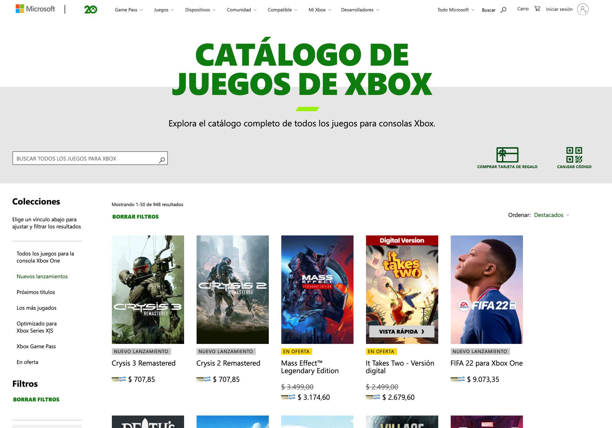

# # Xbox + ARS + Taxes 💳🇦🇷

> A Chrome extension to browse the full catalog of all Xbox games in ARS + Taxes.

### Installation Instructions

1. Download this repo as a [ZIP file](https://github.com/pazguille/xbox-precios-extension/archive/main.zip).
2. Unzip the file and you should have a folder named `xbox-precios-extension-main`.
3. In Chrome go to [the extensions page](chrome://extensions) (`chrome://extensions`).
4. Enable `Developer Mode` checkbox.
5. Drag the `xbox-precios-extension-main` folder anywhere on the page to import it. Do not delete the folder afterwards.
6. Navigate to [Xbox Store AR](https://www.xbox.com/es-ar/games/all-games)
7. Click the extension icon to turn-on.

## Made with ❤ by

- Guille Paz (👨‍💻 Front End Web Developer | ⚡️ Web Performance Lover)
- E-mail: [guille87paz@gmail.com](mailto:guille87paz@gmail.com)
- Twitter: [@pazguille](https://twitter.com/pazguille)
- Web: [https://pazguille.me](https://pazguille.me)

## License

MIT license. Copyright © 2021.
